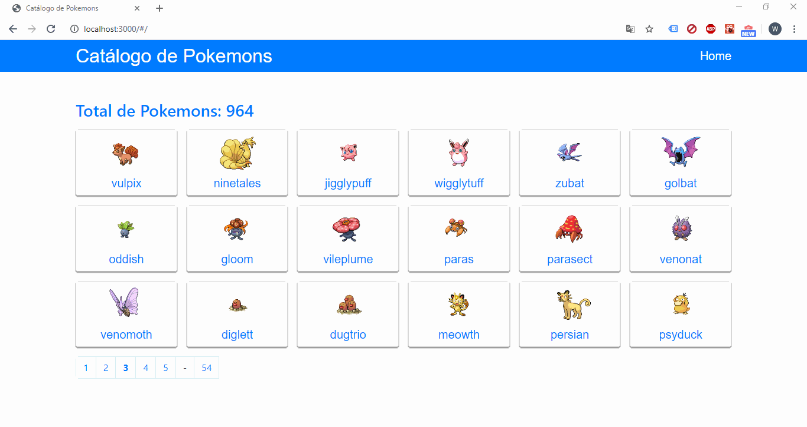

# Desafio React

# Descrição

O projeto é resultado de um desafio react. A proposta do desafio era desenvolver uma aplicação utilizando React e a API PokeAPI para consultar informações sobre os pokemons e disponibilizar em uma interface amigavel e com paginação.

## Instruções

Utilize os seguintes comandos no terminal:

### `npm install`

### `npm start`
